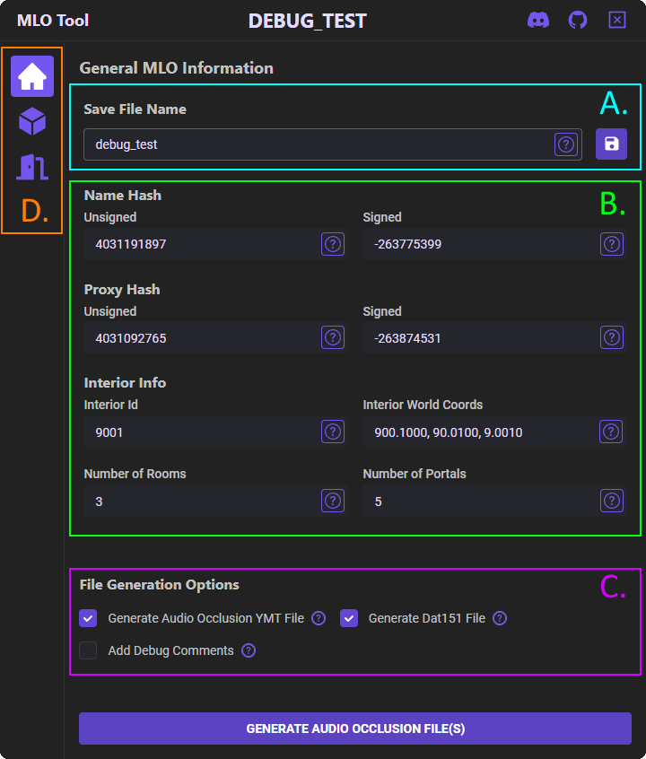
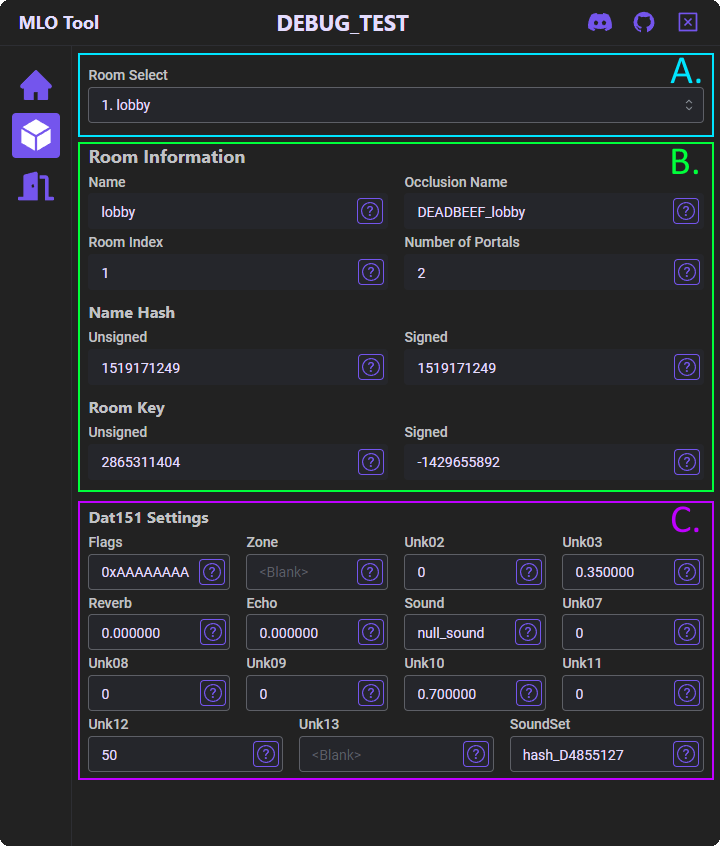
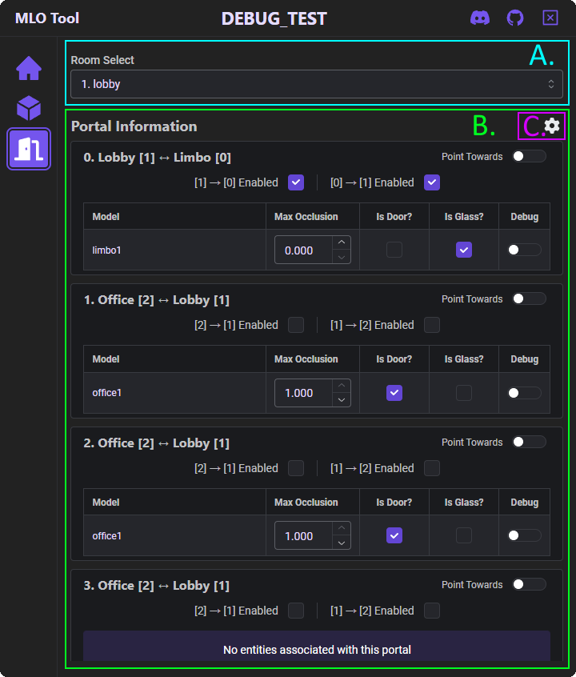

# UI Breakdown

## General Tab

A. **Save File Name**
- Used to specify the name of the save file
- Save button will save the progress without generating the occlusion files, similar to the [/savemlo](./usage-guide.md#savemlo) command

B. **Information Fields**
- Used to display information about the current MLO
- *Note* - These are READONLY fields

C. **File Generation Option Toggles**
- It is recommended to generate and use both the `Audio Occlusion YMT` file and the `Dat151` file
- `Add Debug Comments` should only be used understand how the files are generated or debug issues, CodeWalker currently [doesn't parse comments in XML correctly](https://github.com/dexyfex/CodeWalker/issues/179).

D. **Sections Tabs**
- Used to navigate between the tabs that hold additional information about the pieces of the current MLO

## Rooms Tab

A. **Room Select**
- Used to select the room to view further information about
- This should default to the room that your ped is currently located in when the UI is opened with the [/openmlo](./usage-guide.md#openmlo) command

B. **Room Information**
- Used to display information about the Room that is currently selected
- *Note* - These are READONLY fields

C. **Dat151 Settings**
- Used to view and edit values for a room such as `Reverb` and `Echo`

## Portals Tab

A. **Room Select**
- Used to select the room to view further portal information for
- This should default to the room that your ped is currently located in

B. **Portal Information**
- Displays and allows for editing of portal occlusion settings
- `Enabled` Toggles allow for completely removing any possible change of sound passing through a portal, or even uni-directional sound
- `Max Occlusion` is a value from `0.0` to `1.0`. The higher the value the less sound that will pass through that entity.
- If an entity is marked as a door, when the door is recognized as open the game will allow sound to travel through the portal freely
- `Debug` switch will draw a debug border around the entity to help you find it
   - This can be useful in cases where the model name is unknown and only the model name hash is shown
   - *Note* - Some cases where the object has a hash collision, or is improperly set up, this **may not** properly draw the debug border around the entity
- Note: Not every portal has entities (such as doors) assigned to them so if you don't see any models assigned to a portal, that's just because they aren't set up to be assigned to the portal

C. **Debug Switches**
- Contains the switches for portal debug functionality
- `Draw Portal Info`
   - Draws text stating portal Ids and the rooms that they connect
- `Draw Portal Outline`
   - Draws simple `[X]` shape around the limits of portals
- `Draw Portal Fill`
   - Draws a transparent color fill within the limits of portals
